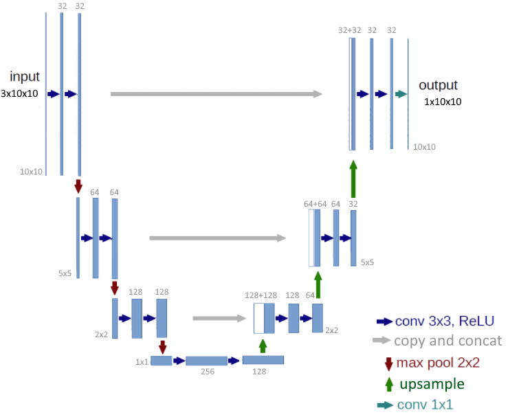

# DeepBattleship
Experiment of DL based AI for the traditional battleship game using a small U-Net style network to predict boat position from hits.

To Generate data:
* python BattleStateGenerator.py

To train:
* python Model/train.py

