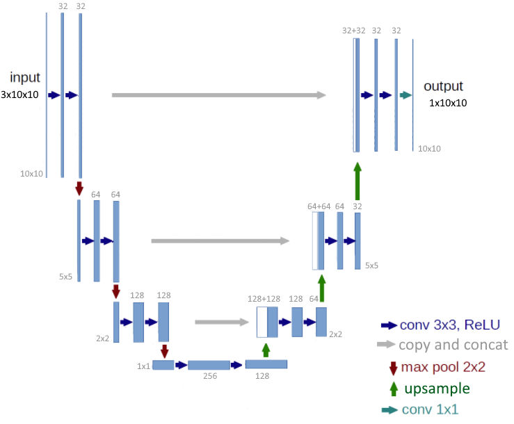

# DeepBattleship
Experiment of DL based AI for the traditional battleship game using a small U-Net style network to predict boat position from hits.

To setup (once):
* uv sync

To Generate data:
* uv run python BattleStateGenerator.py

To browse generated data:
* uv run python ViewGameStates.py

To train:
* cd Model
* uv run python train.py

